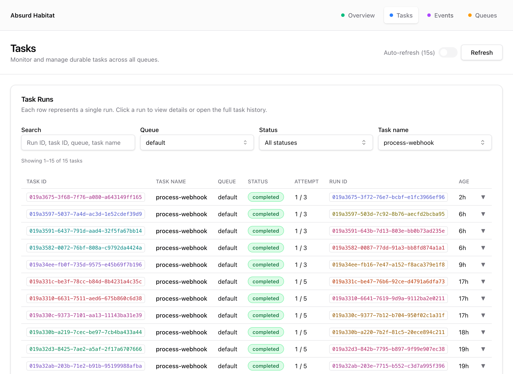

# Absurd Habitat

Habitat is a simple dashboard and monitoring tool for [Absurd](https://github.com/earendil-works/absurd), providing a web UI to visualize and monitor the state of running and executed tasks, queues, and events in a Absurd durable execution system.

It connects straight away to postgres.

<div align="center">
  
</div>

## Building

To build the complete application with the UI bundle embedded:

```bash
make build
```

This will:
1. Install UI dependencies and build the frontend assets
2. Compile the Go binary with embedded assets to `./bin/habitat`

## Running

Start the habitat server:

```bash
./bin/habitat run -db-name your-database-name
```

The dashboard will be available at `http://localhost:7890` by default.

## Configuration

Habitat can be configured via command-line flags or environment variables (prefixed with `HABITAT_`).

### Database Options

| Flag | Environment Variable | Default | Description |
|------|---------------------|---------|-------------|
| `-db-url` | `HABITAT_DB_URL` | - | Full Postgres connection URL |
| `-db-host` | `HABITAT_DB_HOST` | `localhost` | Postgres host |
| `-db-port` | `HABITAT_DB_PORT` | `5432` | Postgres port |
| `-db-name` | `HABITAT_DB_NAME` | `absurd` | Database name |
| `-db-user` | `HABITAT_DB_USER` | - | Database user |
| `-db-password` | `HABITAT_DB_PASSWORD` | - | Database password |
| `-db-sslmode` | `HABITAT_DB_SSLMODE` | `disable` | SSL mode |

### Server Options

| Flag | Environment Variable | Default | Description |
|------|---------------------|---------|-------------|
| `-listen` | `HABITAT_LISTEN` | `:7890` | Address to listen on |
