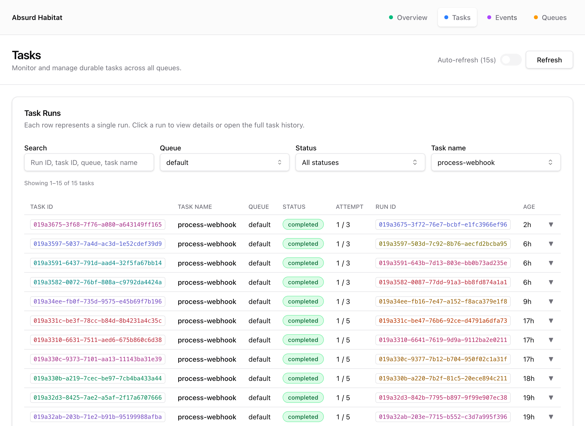

# Absurd Habitat

Habitat is a simple dashboard and monitoring tool for [Absurd](https://github.com/earendil-works/absurd), providing a web UI to visualize and monitor the state of running and executed tasks, queues, and events in a Absurd durable execution system.

It connects straight away to postgres.

<div align="center">
  
</div>

## Installation

Download the latest binary from [GitHub Releases](https://github.com/earendil-works/absurd/releases/latest).

## Running

Start the habitat server:

```bash
habitat run -db-name your-database-name
```

The dashboard will be available at `http://localhost:7890` by default.

## Configuration

Habitat can be configured via command-line flags or environment variables (prefixed with `HABITAT_`).

### Database Options

| Flag | Environment Variable | Default | Description |
|------|---------------------|---------|-------------|
| `-db-url` | `HABITAT_DB_URL` | - | Full Postgres connection URL |
| `-db-host` | `HABITAT_DB_HOST` | `localhost` | Postgres host |
| `-db-port` | `HABITAT_DB_PORT` | `5432` | Postgres port |
| `-db-name` | `HABITAT_DB_NAME` | `absurd` | Database name |
| `-db-user` | `HABITAT_DB_USER` | - | Database user |
| `-db-password` | `HABITAT_DB_PASSWORD` | - | Database password |
| `-db-sslmode` | `HABITAT_DB_SSLMODE` | `disable` | SSL mode |

### Server Options

| Flag | Environment Variable | Default | Description |
|------|---------------------|---------|-------------|
| `-listen` | `HABITAT_LISTEN` | `:7890` | Address to listen on |
| `-base-path` | `HABITAT_BASE_PATH` | - | Serve UI/API under a URL prefix (e.g. `/habitat`) |

When Habitat is behind a reverse proxy, it also honors `X-Forwarded-Prefix` (plus
`X-Forwarded-Path` / `X-Script-Name`) to generate correct UI and API URLs.
